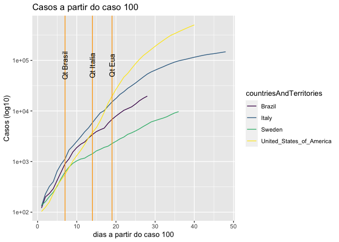
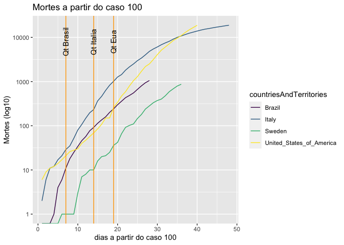
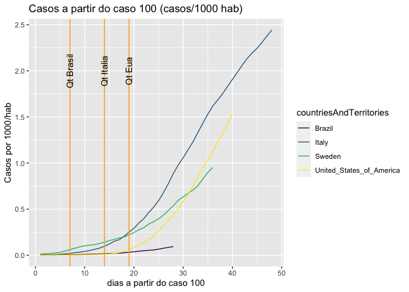
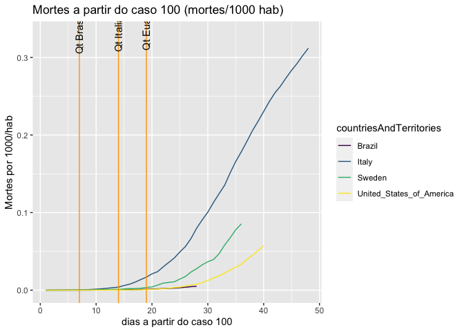

Analise sem qualquer tipo de conhecimento em epidemiologia usando R.

``` r
source("./init.R")
```

    ## [1] "All requested packages already installed"

Usei o critério de 100 casos confirmados para o D0 da epidemia, porque
100? porque sim.

Abaixo estão os dados de Casos a partir do centésimo caso comparando Brasil, EUA, Italia, e Suécia
--------------------------------------------------------------------------------------------------

``` r
#data <- read.csv("https://opendata.ecdc.europa.eu/covid19/casedistribution/csv", na.strings = "", fileEncoding = "UTF-8-BOM")

plist <- buildPaises(data,100, "BR","US","IT","SE")
plotChart(plist,"Casos a partir do caso 100","Casos (log10)","log10","cum_cases") +
geom_vline(xintercept=7, color="orange", size=.5)  +
geom_vline(xintercept=14, color="orange", size=.5) +
geom_vline(xintercept=19, color="orange", size=.5) +
annotate(geom="text", x=7, y=80000,
             label="Qt Brasil", angle = 90) +
annotate(geom="text", x=14, y=80000,
             label="Qt Italia", angle = 90) +
annotate(geom="text", x=19, y=80000,
             label="Qt Eua", angle = 90)
```



Dados de Mortes a partir do centésimo caso comparando Brasil, EUA, Italia, e Suécia
-----------------------------------------------------------------------------------

``` r
#data <- read.csv("https://opendata.ecdc.europa.eu/covid19/casedistribution/csv", na.strings = "", fileEncoding = "UTF-8-BOM")

plist <- buildPaises(data,100, "BR","US","IT","SE")
plotChart(plist,"Mortes a partir do caso 100","Mortes (log10)","log10","cum_deaths") +
geom_vline(xintercept=7, color="orange", size=.5)  +
geom_vline(xintercept=14, color="orange", size=.5) +
geom_vline(xintercept=19, color="orange", size=.5) +
annotate(geom="text", x=7, y=8000,
             label="Qt Brasil", angle = 90) +
annotate(geom="text", x=14, y=8000,
             label="Qt Italia", angle = 90) +
annotate(geom="text", x=19, y=8000,
             label="Qt Eua", angle = 90)
```

    ## Warning: Transformation introduced infinite values
    ## in continuous y-axis

 \#\#
Dados de Casos por 1000 habitantes a partir do centésimo caso comparando
Brasil, EUA, Italia, e Suécia

``` r
plist <- buildPaises(data,100, "BR","US","IT","SE")
plotChart(plist,"Casos a partir do caso 100 (casos/1000 hab)","Casos por 1000/hab","identity","cum_cases_1000") +
geom_vline(xintercept=7, color="orange", size=.5)  +
geom_vline(xintercept=14, color="orange", size=.5) +
geom_vline(xintercept=19, color="orange", size=.5) +
annotate(geom="text", x=7, y=2,
             label="Qt Brasil", angle = 90) +
annotate(geom="text", x=14, y=2,
             label="Qt Italia", angle = 90) +
annotate(geom="text", x=19, y=2,
             label="Qt Eua", angle = 90)
```

 \#\#
Dados de Mortes por 1000 habitantes a partir do centésimo caso
comparando Brasil, EUA, Italia, e Suécia

``` r
plist <- buildPaises(data,100, "BR","US","IT","SE")
plotChart(plist,"Mortes a partir do caso 100 (mortes/1000 hab)","Mortes por 1000/hab","identity","cum_deaths_1000") +
geom_vline(xintercept=7, color="orange", size=.5)  +
geom_vline(xintercept=14, color="orange", size=.5) +
geom_vline(xintercept=19, color="orange", size=.5) +
annotate(geom="text", x=7, y=0.33,
             label="Qt Brasil", angle = 90) +
annotate(geom="text", x=14, y=0.33,
             label="Qt Italia", angle = 90) +
annotate(geom="text", x=19, y=0.33,
             label="Qt Eua", angle = 90)
```


